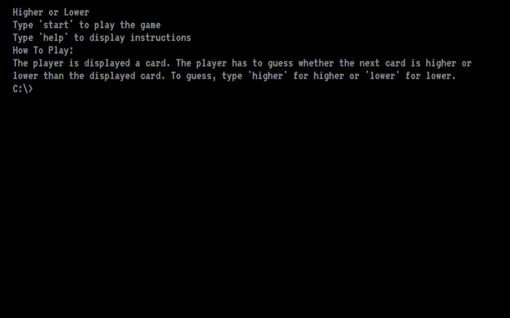

# Higher or Lower





## What is Higher or Lower?

Higher or Lower is a simple card game where the user is displayed a card and has to choose whether the next card is higher or lower than the displayed card.

## Technical Discussion

* HTML
* CSS
* JavaScript/jQuery

### Notes on Game Structure

#### Code Samples
```
let Card = function(suit, faceVal, numVal){
  this.suit = suit
  this.faceVal = faceVal
  this.numVal = numVal
}
```
```
let suits = ['\u2660','\u2665','\u2666','\u2663']
  let faceValues = ['A', '2', '3', '4', '5', '6', '7', '8', '9', '10', 'J', 'Q', 'K']
  suits.forEach(function(suit){
    faceValues.forEach(function(faceVal, numVal){
    let card = new Card(suit, faceVal, numVal + 1)
    deck.push(card)
  })
})
```
```
for(let i = 0; i < 500; i++){
  let loc1 = Math.floor(Math.random() * deck.length)
  let loc2 = Math.floor(Math.random() * deck.length)
  let tmpLoc = deck[loc1]

  deck[loc1] = deck[loc2]
  deck[loc2] = tmpLoc
}
```
#### Challeneges
Making my game act like a DOS based game

## The Making of Higher or Lower
[how to create a card deck in JS](http://www.thatsoftwaredude.com/content/6196/coding-a-card-deck-in-javascript)

[unicode for card suits](https://en.wikipedia.org/wiki/Playing_cards_in_Unicode#Card_suits)

## Opportunities for Future Growth

I am satisfied with what I built. My code could possibly have been written better, but it's easy for me to read and understand what is going on.