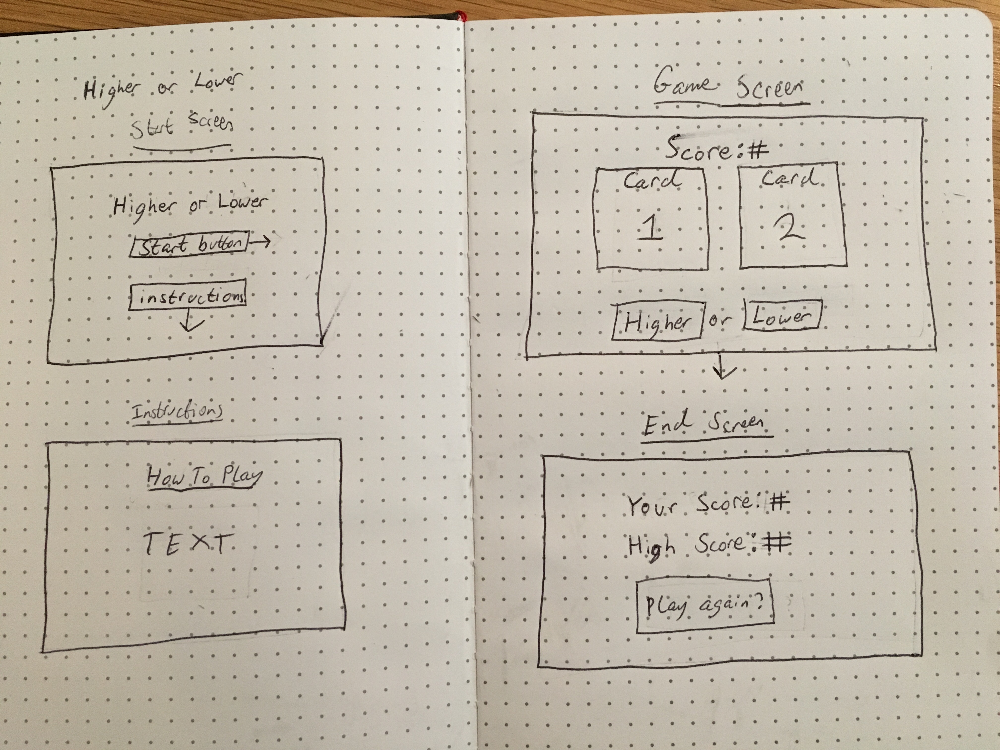

*** Philip Zak / 7.11.17 ***

# Higher or Lower Proposal

## What is Higher or Lower?

Higher or Lower is a simple card game where the user is displayed a card and has to choose whether the next card is higher or lower than the previous card.

## Wireframe

## Initial thoughts on game structure

* Possible Challenges
  * How to handle displaying card 2
  * Comparing both cards
  * How to set card 2 to be card 1
  * Making the cards

## Phases of Completion

  ### Phase 0
  * Create empty array for deck
  * Create arrays for card suit and value
  * Shuffle cards into deck array
  ### Phase 1
  * Display one card at a time
  ### Phase 2
  * Compare card 1 to card 2
    * If user is right
      * increment score
      * set card 2 to card 1, display new card 2
    * If user is wrong
      * stop game
        * display end game screen which displays current score and high score
        * If current score is higher than current high score, update high score
  * Replace card 1 with card 2
    * keep going until user either:
      * reaches end of deck array
        * deck gets shuffled
        * keep track of score
        * user continues to play
      * user guesses wrong and game ends
  * Build out game in HTML using jQuery
    * create start screen
    * create instructions
    * create the cards
    * create board
    * create score holder
    * create end game screen
  ### Phase 3
  * make game look pretty
  * add any fancy features

## Links and Resources

[how to create a card deck in JS](http://www.thatsoftwaredude.com/content/6196/coding-a-card-deck-in-javascript)

[unicode for card suits](https://en.wikipedia.org/wiki/Playing_cards_in_Unicode#Card_suits)